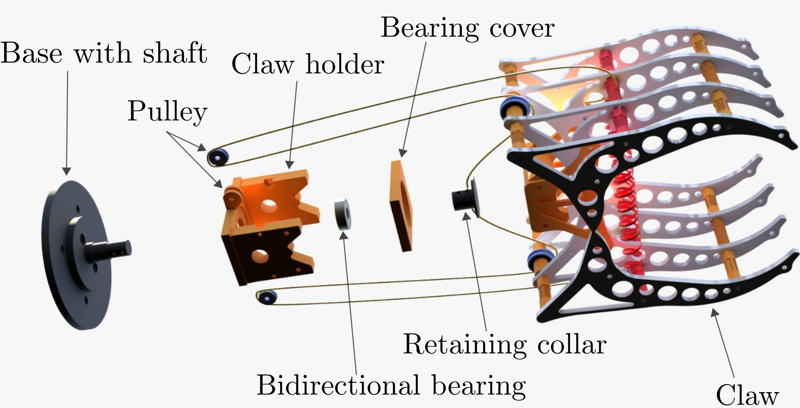

# Gripper

In folder ```./gripper_parts/initial``` you can find .stl files for gripper. They are put in this folder so you can create new .stl files but still keep track of the original one. 

Each .stl file has ending ```x{NUMBER}``` stating how many copies of each part you need.

Here is how the whole system for passive grasping looks like.
<p align="center">
  
</p>

Besides this .stl files you will need:
- springs,
- spacers, 
- rope.

Use [PrusaSlicer](https://www.prusa3d.com/page/prusaslicer_424/) to create .gcode and print it on 3D printer.

For each new version create folder and name it v2, v3, etc.

# Agiler PiPER 

Instruction and tasks for Agilex PiPER mount.

Students should come to FER and measure dimensions of flange.