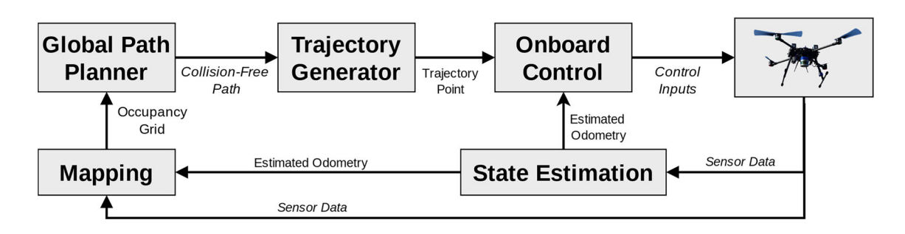
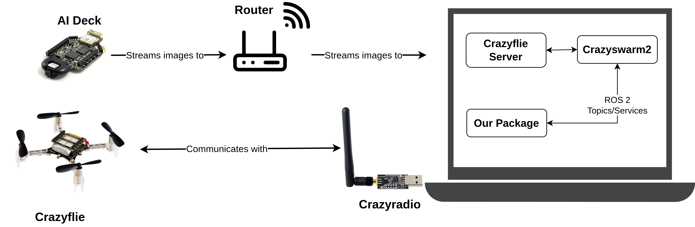

# Git, Docker, Fusion and more

In this tutorial you will go through basics of git, docker and fusion. After each section there is small hands-on exercise. 

---
## Git

A **version control system**. An indispensable tool when multiple people are developing code. It is most commonly used in the terminal, but there are also GUI applications.

Common commands (no need to memorize them, you'll encounter them often enough):
- `git clone git@github.com:AuthorRepoName` - clones the repository locally to your computer,
- `git pull origin BranchName` - fetches code (and changes in it) from Git for the branch BranchName,
- `git status` - reviews changes you made compared to those fetched from Git,
- `git add FileName` - stages all changed files you want to send to Git,
- `git commit -m "Message"` - The message in quotes describes the changes (recommended in imperative form),
- `git push origin BranchName` - Pushes your changes to Git on the desired branch BranchName,
- `git checkout BranchName` - switches to another branch,
- `git branch -b NewBranchName` - creates a new branch (be cautious, you need to push this change for it to be visible).

There are many more commands you can look up online. For starters, I suggest merging directly on GitHub.

<p align="center">
  
</p>

Setting up an SSH key. It simplifies using Git. [HOWTO!](https://docs.github.com/en/authentication/connecting-to-github-with-ssh/generating-a-new-ssh-key-and-adding-it-to-the-ssh-agent)
- ```bash 
    ssh-keygen -t ed25519 -C "ivo.ivic@gmail.com"
    ```
- ```bash 
    eval "$(ssh-agent -s)"
    ```
- ```bash
    ssh-add ~/.ssh/id_ed25519
    ```
- ```bash
    cat ~/.ssh/id_ed25519.pub
    ```
- Copy the string that appears and paste it into GitHub's SSH key settings.

**NOTA BENE**
- After making changes, it's always good to review what has been modified or added using the command:
    ```bash
    git status
    ```
- After your changes, always push your code. The most common pattern when pushing is to push all your changes:
        
    ```bash
    git add .
    git commit -m "Add new ROS node for path planning"
    git push origin master
    ```
- If you know someone else has made changes, fetch (pull) the code, especially if you're working on the same branch:
    ```bash
    git pull origin master
    ```

Common obstacles:
- Conflicts during merging,
- Pushing without pulling first.

## Hands-on #1

This is done one-by-one.

1. Clone the repository:
    ```bash
    git clone git@github.com:JakobDomislovic/undergrad_project_larics_2025.git
    cd undergrad_project_larics_2025/
    ```
2. One by one, write your name in README.md.
3. One person needs to create hello_world.py: ```print("Hello world!")```.
4. Push your changes to GitHub (NB: You must be in the main directory undergrad_project_larics_2025 because that's where the .git file is located, which knows how to transfer changes it to GitHub. Other repositories don't have this!):
    ```bash
    git status # review your changes
    git add . 
    git commit -m "Add my name and Hello world script."
    git push origin master
    ```
6. Use the README.md in your directory as a work diary (weekly report). Not doing anything is also okay if there's a valid reason :-). 

## Docker

Docker is explained in more detail in the [wiki](https://github.com/larics/docker_files/wiki). I suggest reading the previous link in your free time.

At this level, you can think of Docker as a type of virtual machine (although this is not entirely accurate, it conveys the idea well enough). It is used to quickly, efficiently, and relatively easily transfer a system from one robot to another.

For example, we developed a system on a drone throughout the entire undergraduate project, installed many new libraries, and set up various scripts in the system. Two weeks before submission, the drone crashes into water, and we lose everything. How long would it take to set everything up again? Do we even remember all the changes? The solution: If we save all these things in Docker, we can set up the system on a new drone in less than 5 minutes.

<p align="center">
  
</p>
Common commands:

- `docker ps -a` - lists all installed containers and their statuses,
- `docker image -ls` - lists all Docker images on the computer,
- `docker build` - creates an image from a Dockerfile,
- `docker run` - creates a container from an image,
- `docker exec -it ContainerName bash` - starts a container.

At this level, it's enough to follow the commands in the next section. Docker is becoming/has become an indispensable tool in all fields of computing, telecommunications, robotics, etc.

---

## Flight stack
In programming, you'll often encounter the term *stack*, which represents software blocks that can work independently but, when connected, form a larger system. Below is an example of such a stack, the LARICS stack for autonomous flight.

The stack is placed in a Docker container and can be easily fetched. It contains the basic components needed for a drone to fly. Below is an image showing the stack's components. You don't need to know all of them; it's just given as an example.
<p align="center">
  
</p>

Since robots are expensive and we're always short on time, the practice in robotics is to test everything in simulation first. That's why we'll use the same stack but already converted for simulation.


## Crazyflies

### Hands-on #2
---

In this hands-on, you will set up crazyflies simulation stack and run your first simulation. Please refer to the document [here](../crazyflies/crazyflies_sim/docs/tutorial_handson_2.md) 

### Control stack
---

Crazyflies are mini, open-source quadcopters designed primarily for research and education. Despite their small size (about 27 g), they feature a full flight stack, inertial sensors, and a flexible firmware. One of the main advantages is their modular design that supports a wide range of hardware decks, including the AI-deck for onboard vision processing and Flow-deck for optical flow-based stabilization, which you will be using in this project.

Each Crazyflie communicates with your laptop via a Crazyradio dongle. Every UAV Crazyflie has a unique resource identifier, which looks like radio://0/90/2M/E7E7E7E7E7. The AI-deck is mounted on top of the Crazyflie and connects to a Wi-Fi router, streaming images over the UDP protocol that can be received by any computer connected to the same network. When using a single Crazyflie, the router can be bypassed, since the AI-deck can create its own Wi-Fi access point, allowing your computer to connect directly and stream images.

<p align="center">
  
</p>

One major advantage of using Crazyflies for research and educational prototyping is the readily available control stack. The Crazyflie server, in combination with the Crazyswarm2 ROS 2 package, manages all low-level processing, control, and communication tasks. Your ROS 2 package can then directly interact with the Crazyflie through topics and services such as takeoff, landing, velocity control and image.

### Hands-on #3
---

Connect to the WiFi Access Point on your laptop names `WiFi Streaming Example`.

In one terminal run the script to stream images as a ROS 2 topic:

```bash
ros2 run crazyflies_sim aideck_streamer_demo.launch
```

This script processes incoming UDP packets into image frames and publishes them as a ROS 2 topic. You don’t need to worry about the internal workings of the script. You can then open rviz2 and visualize the image on the topic /cf_1/image.

A separate Docker setup for hardware will be provided in the near future. This example is for demonstration only. Your algorithm should ideally remain consistent between simulation and hardware, requiring only parameter tuning if needed (eg adjusting control speeds, image preprocessing settings, safety checks etc).

---

# Fusion

Download Fusion 360, you have student license. 

After that download Fusion, and watch this tutorials one by one:

1. https://www.autodesk.com/learn/ondemand/tutorial/introduction-to-fusion
2. https://www.autodesk.com/learn/ondemand/tutorial/components-and-bodies
3. https://www.autodesk.com/learn/ondemand/tutorial/sketch-fundamentals
4. https://www.autodesk.com/learn/ondemand/tutorial/extrude-solid-bodies
5. https://www.autodesk.com/learn/ondemand/curated/creating-assemblies

Come to us with questions!